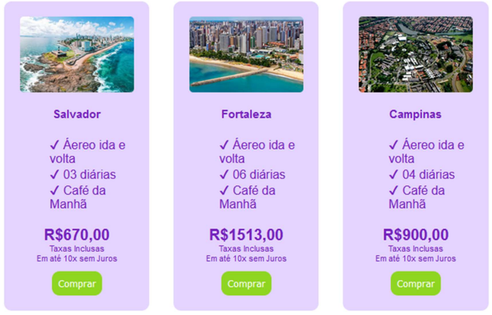
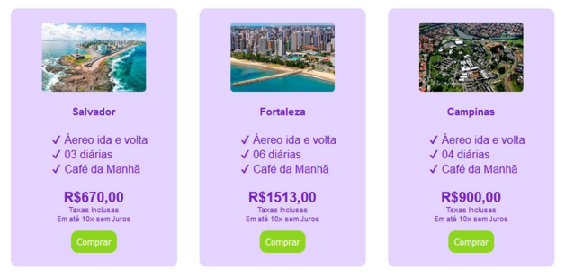
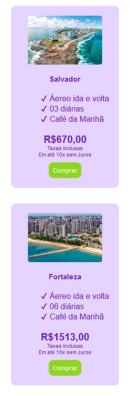

# Sobre

Este repositório foi desenvolvido para adicionar a resolução dos exercícios da instrução prática 3 do módulo de Front End da Residência em Software promovido pela CEPEDI em parceria com a UESC.

# 📑Instruções práticas

> Criação de um design para ser uƟlizado por uma agência de turismo. A tarefa consiste em criar uma classe de desƟnos, na qual deve incluir: o nome do destino, a imagem principal do destino, o que está incluso no pacote, o preço e se as taxas estão inclusasou não, a forma de pagamento e por fim o botão de comprar. O design deve ser flexível e deve ser capaz de abrigar 3 destinos quando a janela possuir uma largura maior que 1200px como ilustrado na Figura 1.

> 

> À medida que a janela do navegador vai crescendo as classes dos destinos devem crescer também até atingirem uma largura de no máximo de 200px, como ilustra a Figura 2.

> 

> Ao diminuir a janela do navegador para uma largura menor que 1200px, as classes de destino devem ser dispostas uma embaixo da outra como ilustra a Figura 3.

> 

# Autores

| [ Lucas dos Santos Silva](https://github.com/eulucasilva) |
| :-----------------------------------------------------------------------------------------------------------------------------------------------: |
