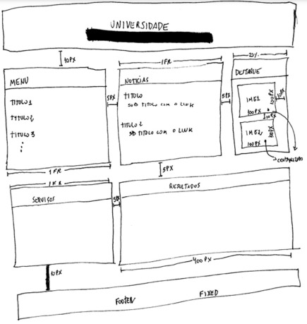

# Sobre

Este repositório foi desenvolvido para adicionar a resolução dos exercícios da instrução prática 5 do módulo de Front End da Residência em Software promovido pela CEPEDI em parceria com a UESC.

# 📑Instruções práticas

> A ideia dessa atividade é que o aluno implemente promises que busquem por dados em APIs públicas na Internet para preencher o site da UESC desenvolvido na FEB-002. O aluno deve buscar APIs na Internet e preencher os seguintes quadros do design da página desenvolvida com a devida formatação utilizando CSS: 
>- Quadro “Notícias” com notícias sobre o meio acadêmico;
>- Quadro “Serviços” com a previsão do tempo do campus da UESC;
>- Todos os outros quadros da página com informações aleatórias de relevância acadêmica ou úteis para a comunidade da UESC obtidas de APIs atualizadas constantemente.

>Para critério de avaliação da tarefa a ser entregue pelo aluno, será levado em consideração os seguintes itens que devem ser incluídos na elaboração do novo design:
>- Uso de técnicas de designs flexíveis e grid layout vistas nas aulas anteriores;
>- Utilização de todas as variáveis declaradas com o tipo no estilo TypeScript;
>- Uso de classes e objetos no formato do TypeScript;
>- Integração e utilização da biblioteca JQuery no TypeScript;
>- Utilizar o JSON sempre quando possível para trocar informações do front-end com o back-end;
>- Desenvolver uma funcionalidade adicional na página que não está listada na especificação da tarefa. Ex: Um carrossel de imagens, status de serviços da universidades, etc.
> Ser criativo e profissional.

# Autores

| [ Lucas dos Santos Silva](https://github.com/eulucasilva) | 
|:-------------------------------------------------------------------------------------------------------------------------------------------------:|
