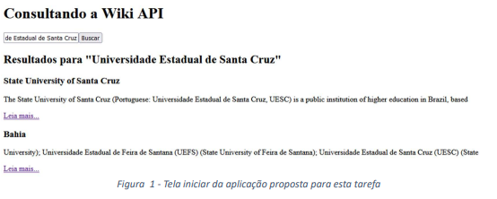

# Sobre

Este repositório foi desenvolvido para adicionar a resolução dos exercícios da instrução prática 08 do módulo de Front End da Residência em Software promovido pela CEPEDI em parceria com a UESC.

# 📑Instruções práticas

> A Wikipédia é um projeto de enciclopédia multilíngue de licença livre baseado na web e escrito de maneira colaborativa. Foi lançado em 2001 por Jimmy Wales e Larry Sanger e é atualmente administrado pela Fundação Wikimedia, integrando vários projetos mantidos pela fundação. É formada por mais de 61 milhões de artigos (1116 554 em português, até 7 de janeiro de 2024) escritos de forma conjunta por diversos editores voluntários ao redor do mundo. Em maio de 2023, havia edições ativas da Wikipédia em 321 idiomas. A Wikipédia também disponibiliza uma API para os desenvolvedores Web ( https://www.mediawiki.org/wiki/API:Main_page), onde podem ser consultados seus artigos por chamadas a uma REST API. O objetivo dessa tarefa é criar uma aplicação web para a consulta de artigos na Wikipédia e disponibilizá-los para os usuários.

> A Figura 1 ilustra um esboço da tela inicial da aplicação a ser desenvolvida para esta tarefa. O usuário deve inserir o termo da busca e a aplicação deve exibir um resumo do resultado da consulta e um endereço que deve ser direcionado para a página com mais informações sobre o artigo retornado. A aplicação a ser desenvolvida, deve se separada em componentes que devem ser chamados a partir do componente app.component por seus seletores e organizados utilizando um layout de sua preferência. Considere os seguintes componentes:
>
> - Barra de busca – Template onde devem ser manipulados todos os objetos que o usuário deve interagir para realizar a busca do verbete;
> - Resultado da Pesquisa – Deve ser organizados os artigos retornados pela busca;

> Crie um Service que deve ser responsável em consultar a API da wikipedia e retornar os resultados. Esse service deve ser injetado no app.component principal que através de comunicação de componentes deve alimentar o componente de Resultado da Pesquisa. Crie um pipe para formatar o texto exibido na pesquisa para negrito, toda vez que ele encontrar uma correspondência do termo pesquisado.

> Para critério de avaliação, será levado em consideração os seguintes itens que devem serconsiderados na tarefa proposta.

> - Utilização de decoradores @Input e @Output para a comunicação entre os componentes;
> - Utilização de classe de Serviço e injeção de dependências;
> - Organização das views de cada componente nos arquivo .css e .html;
> - Indentação e organização do código em TypeScript;
> - Apresentação do design da aplicação.

 

# Autores

| [ Lucas dos Santos Silva](https://github.com/eulucasilva) |
| :-----------------------------------------------------------------------------------------------------------------------------------------------: |
