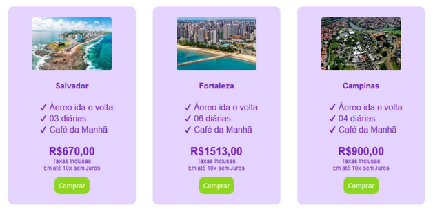

# Sobre

Este repositório foi desenvolvido para adicionar a resolução dos exercícios da instrução prática 2 do módulo de Front End da Residência em Software promovido pela CEPEDI em parceria com a UESC.

# 📑Instruções práticas

> Criação de um novo design para a página da web da UESC. A página deve ter dois designs diferentes de acordo com o tamanho da tela do dispositivo que a acessa. Para dispositivos com telas maiores que 500px deve ser levado em consideração o croqui da Figura 1. Para dispositivos com telas menores que 500px deve ser utilizado o croqui da Figura 2. 

>Para critério de avaliação da tarefa a ser entregue pelo aluno, será levado em consideração os seguintes itens que devem ser incluídos na elaboração do novo design:
>- Uso da propriedade display:grid;
>- Uso de pelo menos 3 fontes externas que podem ser pesquisadas no site do google Fonts;
>- Uso de um arquivo externo para a programação CSS;
>- Utilização de pelo menos 2 cores;
>- Utilização do modelo Box para separar os elementos HTML;
>- Uso da propriedade display: inline-block;
>- Considerar os espaçamentos descritos nos croquis;
>- Preencher quando possível a página com texto Lorem Ipsum.
>- Emprego da técnica de Media query para a criação de design responsivo.
>A tarefa pode ser feita por até 2 alunos.

# Autores

| [ Lucas dos Santos Silva](https://github.com/eulucasilva) | 
|:-------------------------------------------------------------------------------------------------------------------------------------------------:|
