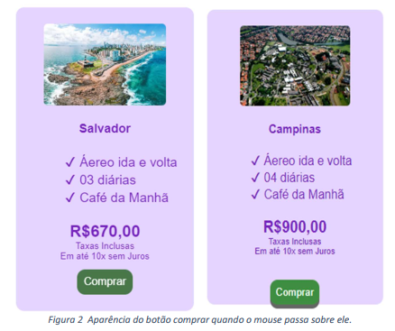

# Sobre

Este repositório foi desenvolvido para adicionar a resolução dos exercícios da instrução prática 4 do módulo de Front End da Residência em Software promovido pela CEPEDI em parceria com a UESC.

# 📑Instruções práticas

> A tarefa consiste em atualizar a página da web criada na FEB-P003. Considere o design da Figura 1. Pesquise as propriedades do CSS cursor, transition-duration , box-shadow e transform, além das pseudo-classes :hover, :active. Use os conceitos pesquisados para mudar a aparência do botão comprar de tal forma que quando o usuário passaro mouse por cima dele, esse botão muda para uma outra cor, como também o cursor do mouse. Além disso, quando o usuário clicar no botão, deve ser iniciada uma animação utilizando a propriedade transform como ilustrado na Figura 2.

> 

> 

> A segunda parte da tarefa é criar um código JavaScript para capturar todas as informações do pacote turístico, criar um objeto JSON e depois imprimi-lo no console. Para isso, associe um evento click em cada botão e capture as informações utilizando os métodos da API do DOM, como por exemplo, querySelector. Depois preencha um objeto JSON com todos os dados capturados e depois imprima esse objeto no console.

> A terceira parte da tarefa é criar um novo arquivo HTML e elaborar um formulário, onde o usuário vai preencher todas as informações (incluído a URL da imagem) do pacote turístico.Quando o usuário clicar no botão inserir, use o JavaScript e os métodos da API do DOM para criar um item da classe roteiro-viagens e depois inseri-lo na classe container destinos. Esse código HTML deve ser inserido na mesma página onde está o formulário separado por uma tag 
. Note que o JavaScript não pode modificar o DOM de outra página HTML.

# Autores

| [ Lucas dos Santos Silva](https://github.com/eulucasilva) |
| :-----------------------------------------------------------------------------------------------------------------------------------------------: |
